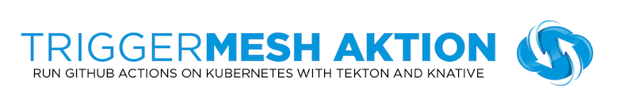

[](https://goreportcard.com/report/github.com/triggermesh/aktion) [](https://circleci.com/gh/triggermesh/aktion/tree/master)



[WIP]: A CLI for running [Github Actions](https://developer.github.com/actions/creating-workflows/workflow-configuration-options/#workflow-blocks) in Kubernetes clusters using [Knative](https://github.com/knative) and [Tekton](https://github.com/tektoncd/pipeline)

## Installation

With a working [Golang](https://golang.org/doc/install) environment do:

```
go get github.com/triggermesh/aktion
```

## Usage

Test that the parsing of your GitHub Action workflow works:

```
aktion parser -f samples/main.workflow
```

Create the Tasks object that Tekton can understand:

```
aktion create -f samples/main.workflow
```

To specify which git repository this should apply to:

```
aktion create -f samples/main.workflow --git https://github.com/sebgoa/klr-demo
```

You can pipe it directly to `kubectl` to create the actions:

```
aktion create -f samples/main.workflow | kubectl apply -f -
```

To launch the actions you need a Knative GitHub source and a _transceiver_ which will receive the GitHub event and create a `TaskRun` object that will execute the `Task` specified. Like this:

```
aktion launch --task knative-test --git sebgoa/cloudbuild
```

## ASCIICAST

[](https://asciinema.org/a/235121)

## Support

This is heavily **Work In Progress** We would love your feedback on this tool so don't hesitate to let us know what is wrong and how we could improve it, just file an [issue](https://github.com/triggermesh/aktion/issues/new)

## Code of Conduct

This plugin is by no means part of [CNCF](https://www.cncf.io/) but we abide by its [code of conduct](https://github.com/cncf/foundation/blob/master/code-of-conduct.md)
